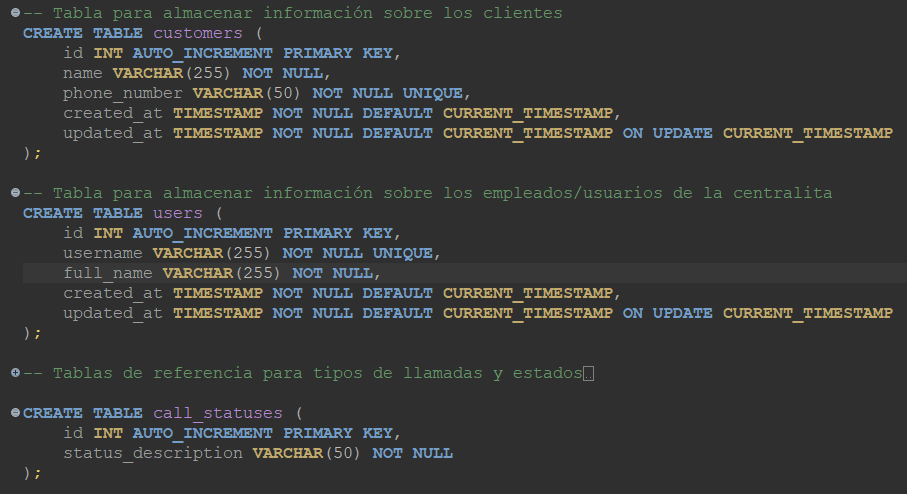
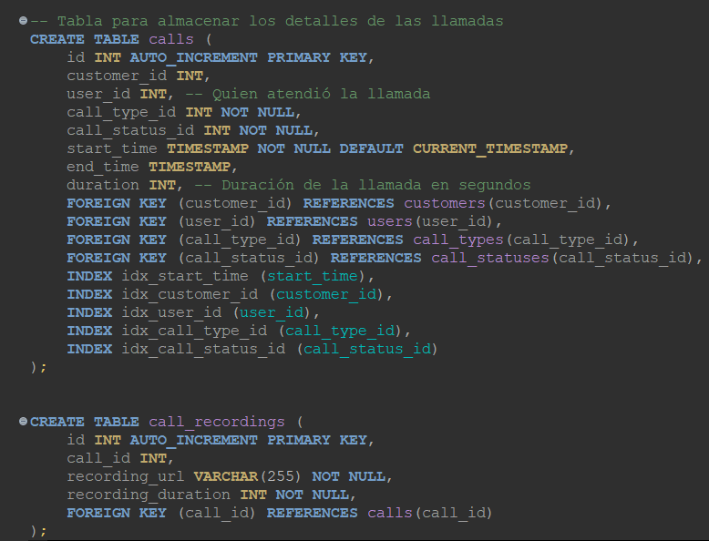
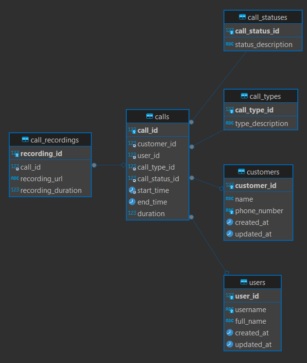

# Pregunta sobre la centralita Asterisk 

#### Queremos tener un registro del número de llamadas recibidas a través de nuestra centralita Asterisk para poder analizar el volumen de llamadas de nuestros clientes. ¿Cómo diseñarías y gestionarías una base de datos para almacenar esta información? Además, ¿qué consideraciones tendríamos que tener en cuenta para asegurar la integridad y eficiencia de los datos almacenados?

Respuesta: A continuación procedo a describir la estructura del diagrama de la base de datos creada con el objetivo de almacenar y analizar el volumen de llamadas de nuestros clientes.

Creación y explicación de tablas

  - Tabla Call_Recordings: Esta tabla almacena las URLs de las grabaciones de las llamadas, permitiendo un acceso rápido a la información auditiva de cada interacción. Se conecta directamente con la tabla calls mediante una Foreign Key, estableciendo una relación uno a uno o uno a muchos dependiendo de si se permite más de una grabación por llamada.

  - Tabla Calls: Actúa como el núcleo central de la base de datos, registrando cada llamada recibida a través de la centralita Asterisk. Esta tabla incluye referencias a varias tablas secundarias mediante Foreign Keys, lo que permite una rica contextualización de cada llamada:

    - Call Statuses: Relaciona cada llamada con su estado actual, permitiendo seguimiento y análisis del proceso de cada interacción.
    - Call Types: Clasifica las llamadas según su naturaleza o el departamento implicado, facilitando la organización y el análisis específico por categorías.
    - Customers: Asocia cada llamada con el cliente que la realizó, permitiendo un enfoque personalizado en el servicio al cliente y en el análisis de interacciones.
    - Users (Empleados): Vincula las llamadas con los empleados que las atendieron, lo que es esencial para la evaluación del desempeño y la asignación de recursos.

Consideraciones de Diseño
  - Integridad de los Datos: Las conexiones entre calls y las tablas secundarias aseguran que cada llamada esté correctamente contextualizada con información válida, gracias al uso de Foreign Keys. Esto previene inconsistencias como estados de llamada no definidos o referencias a usuarios inexistentes.

  - Eficiencia: La estructura facilita consultas eficientes al permitir filtrar, buscar, y analizar llamadas basadas en diversos criterios (tipo, estado, participante) de manera directa, gracias a las relaciones establecidas. Los índices en Foreign Keys y campos críticos para las consultas pueden mejorar significativamente el rendimiento.

  - Seguridad y Control de Acceso: Definir roles específicos para distintos tipos de usuarios en la base de datos, como diferenciar entre roles con permisos de lectura y escritura, refuerza la seguridad y la integridad de los datos, asegurando que solo usuarios autorizados realicen ciertas operaciones.

  - Adaptabilidad y Escalabilidad: La estructura modular y las relaciones claras entre tablas preparan la base de datos para futuras expansiones, como añadir nuevos estados de llamadas, tipos, o integraciones con otras bases de datos o servicios.

<table>
  <tr>
    <td></td>
    <td></td>
  </tr>
  <tr>
    <td colspan="2" align="center"></td>
  </tr>
</table>
