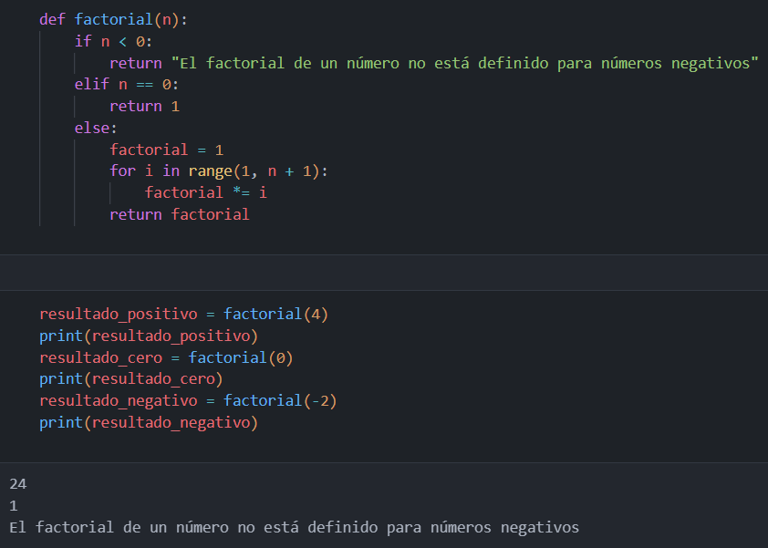

# Resolución de problemas en Python 

#### Desarrolla un script en Python que nos permita calcular el factorial de un número dado. Además, ¿cómo asegurarías que el script maneje correctamente casos especiales como el factorial de 0 y números negativos?

Respuesta: Con la función "factorial" creada en el siguiente script de Python podemos calcular el factorial de un número dado. Dicha función cuenta con 3 condiciones para poder manejar todos los casos especificados:
  1. El factorial de un número negativo siempre nos devolverá el mismo resultado: "El factorial de un número no está definido para números negativos"
  2. El factorial de 0 siempre nos devolverá el resultado del mismo, ya que el resultado de calcular el factorial de 0 = 1
  3. Por último, podremos calcular el factorial de un número positivo cualquiera.
De esta forma podremos saber el factorial de cualquier número que queramos, sin importar si es un caso especial.

  

