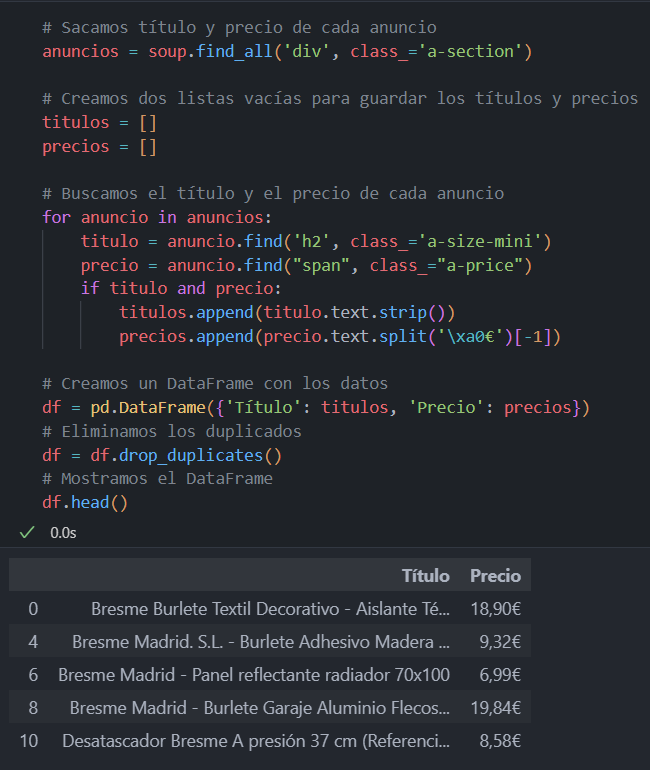
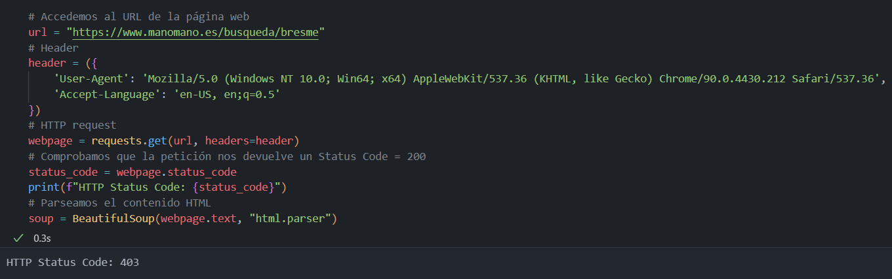
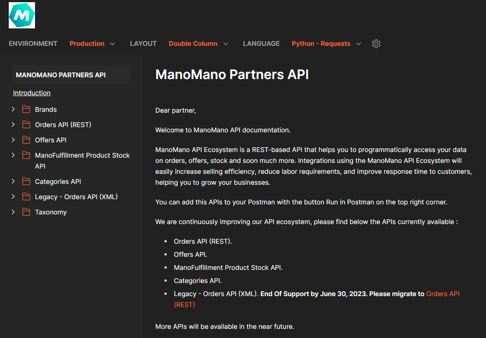

# Pregunta sobre la recopilaci¢n an lisis de precios 

#### Como parte de nuestro análisis de mercado, queremos recopilar y analizar los precios de nuestros productos en los sitios web de Amazon.es y Manoamano.es. ¿Cómo abordarías este problema y qué bibliotecas o herramientas utilizarías?

Respuesta: Como se ve a continuación, realizar webscraping de ambas webs sería el paso más lógico para la posterior recopilación y análisis de todos los productos de Bresme disponibles en las mismas. En Amazon usaría 'BeautifulSoup' y 'Request' como bibliotecas principales, ya que son páginas estáticas que no requieren del uso de Selenium. Sin embargo, a pesar de varios intentos con dichas bibliotecas, la web de ManoMano.es prohibe el acceso como podemos ver con el error '403', por lo que la opción más viable sería acceder a la API de ManoMano y realizar las peticiones desde ahí para poder recopilar toda la información de los productos deseados. 

Una vez realizado todo el scrapeo de ambas webs y teniendo los datos, lo siguiente sería crear un Dataframe con la biblioteca 'Pandas', para poder realizar un EDA más completo y exhaustivo de los datos obtenidos.

<table>
  <tr>
    <td></td>
    <td></td>
  </tr>
  <tr>
    <td colspan="2" align="center"></td>
  </tr>
<table>
