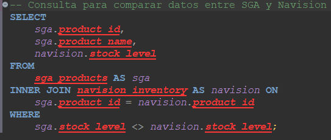

# Pregunta sobre SQL 

#### Imagina que tenemos dos bases de datos diferentes para nuestros productos: una en nuestro Sistema de Gestión de Almacén (SGA) y otra en Navision. ¿Cómo enlazarías y compararías los datos de estos sistemas utilizando SQL? Proporciona un ejemplo de consulta que muestre esta integración y explica qué tipo de JOIN usarías.

Respuesta: La siguiente consulta SQL es para seleccionar, combinar y comparar tablas diferentes que provienen de SGA y Navision. 

Pero, ¿por qué usar INNER JOIN? Para mí era lo más lógico teniendo en cuenta que queríamos enlazar y comparar los datos de ambos sistemas, ya que al usar INNER JOIN combina las filas de ambas tablas basándose en la condición de coincidencia de "sga.product_id = navision.product_id". En este caso, se unen las filas donde el product_id de la tabla sga_products es igual al product_id de la tabla navision_inventory. Con esto me aseguro que solo se incluyan en los resultados aquellos productos que existen en ambas tablas, excluyendo cualquier producto que no tenga un registro correspondiente en una de las tablas.

En resumen, esta query nos permite identificar discrepancias entre los niveles de stock de los productos en ambos sistemas, lo que puede ser útil para la reconciliación de inventario o la detección de errores en los datos.

  

